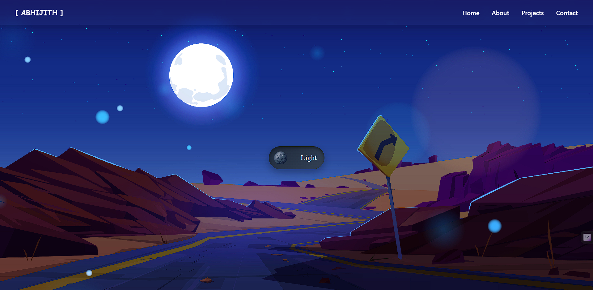
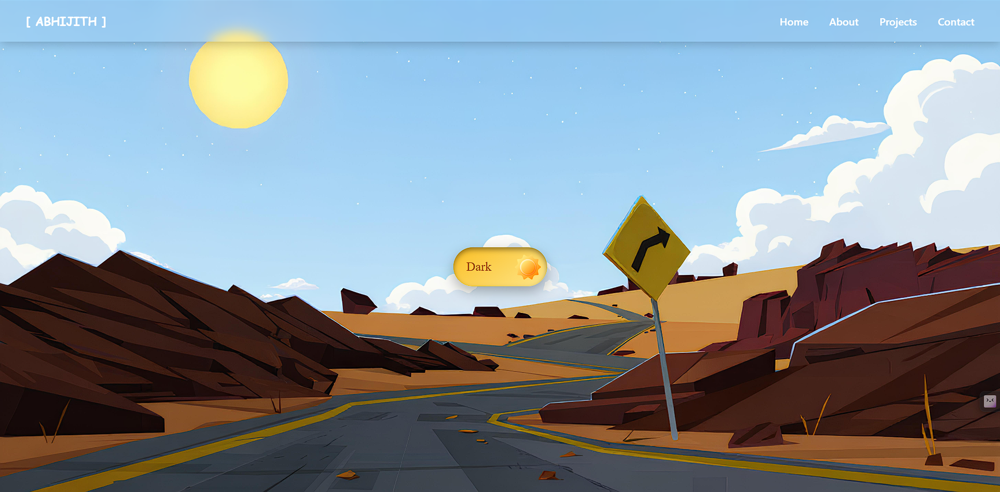

# Dark & Light Mode Toggle Website 🌙☀️

A modern responsive website featuring a smooth dark and light mode switching system with an animated theme toggle button and a glassmorphism sticky navigation bar.

The project uses HTML, CSS, and JavaScript to create an interactive user experience where users can switch between dark and light themes. The theme transition updates the background, toggle icon, colors, and UI elements dynamically.

## Features

- 🌙 Dark mode and ☀️ Light mode switching
- Animated moon/sun toggle button
- Transparent icon-based toggle design
- Sticky glassmorphism navigation bar
- Smooth theme transition animations
- Responsive layout
- Modern gradient backgrounds
- Clean and organized CSS structure

## 📸 Preview





## Technologies Used

- HTML5
- CSS3
- JavaScript
- CSS Flexbox
- CSS Transitions
- Glassmorphism UI Design

## Project Structure

```bash
Dark-Light-Mode/
│
├── index.html
├── style.css
├── script.js
│
├── images/
│ ├── dark-bg.jpg
│ └── light-bg.jpg
│
└── icons/
├── moon.png
└── sun.png
```

## How It Works

- The toggle button uses a checkbox input.
- JavaScript detects the toggle state.
- A `light-theme` class is added or removed from the body.
- CSS changes backgrounds, colors, and animations based on the active theme.

## Purpose

This project demonstrates how to build a theme-switching interface using pure frontend technologies without external libraries. It focuses on UI design, animations, and DOM manipulation.

## Future Improvements

- Save theme preference using Local Storage
- Add mobile navigation menu
- Add more animated backgrounds
- Add system theme detection
